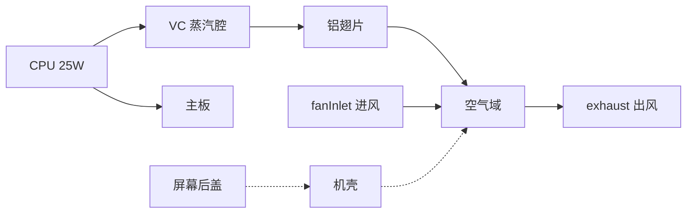

# MacBook Pro 14" 笔记本散热仿真 (OpenFOAM v2412)

基于 **MacBook Pro 14 英寸 (M3 Pro, 2023)** 外形与散热布局的简化共轭传热 (CHT) 算例，使用 `chtMultiRegionSimpleFoam` 求解器（伪瞬态 SIMPLE 算法）。

## 外形参照 (Apple 官方规格)

| 项目 | 尺寸 |
|------|------|
| 整机 (宽 × 深 × 高) | 312.6 × 221.2 × 15.5 mm |
| 显示屏 (可视区) | 302 × 196 mm (14.2") |
| 机壳材料 | 铝合金一体成型 |
| 风扇 | M3 Pro/Max: 双风扇, 最高 ~6800 RPM |
| 散热模块 | 热管 + 铝制均热/扩散 (本算例按用户要求建模为 **VC 蒸汽腔**) |

> 说明：量产 MacBook Pro 使用热管而非 VC；本案例将 VC 作为高导热扩散层，便于演示 CPU→VC→翅片→风扇气流的热路。

## 算例简化域

为控制网格规模，取 CPU–风扇–翅片–屏轴区域 **180 × 160 × 18 mm** 子域，各部件包络框如下 (单位 mm)：

| 区域 | 包络框 (xmin ymin zmin) – (xmax ymax zmax) | 材料/角色 |
|------|---------------------------------------------|-----------|
| **chassis** 机壳 | 底板 + 侧壁 + 顶盖 (见 `topoSetDict`) | 铝合金 |
| **motherboard** 主板 | 20–160, 20–140, 1.2–1.7 | FR4 PCB |
| **cpu** 处理器 | 55–95, 60–100, 1.7–2.2 | 硅/封装, **25 W** 热源 |
| **vc** 蒸汽腔 | 45–105, 50–110, 2.2–2.6 | 等效高导热 (20000 W/m·K) |
| **fins** 翅片 | 130–170, 40–120, 2.6–9.0 | 铝制散热翅片 |
| **screen** 屏幕后盖 | 10–170, 135–158, 10.7–16.5 | 铝合金 + 玻璃等效 |
| **air** 空气 | 机壳内其余流体域 | 强制对流 (风扇) |

## 边界条件

- **fanInlet** (y=0 面): 速度入口 U = (0, 2, 0) m/s, T = 298 K (模拟进风)
- **exhaust** (x=180 面): 压力出口
- **outerWalls**: 外表面对流换热 h = 8 W/m²·K, T∞ = 298 K
- **CPU**: 体积热源 25 W (M3 Pro 持续负载量级)

## 辐射模型 (viewFactor, 默认开启)

| 区域 | 模型 | 说明 |
|------|------|------|
| **air** | `viewFactor` | 空气域计算角系数辐射，参与面标记为 `viewFactorWall` |
| **固体** | `opaqueSolid` | 不透明固体，通过 `qr` 与空气域耦合 |

关键文件：
- `constant/air/radiationProperties` — 开启 `radiation on`
- `constant/air/viewFactorsDict` — `createViewFactors` 控制参数
- `constant/air/boundaryRadiationProperties` — 各辐射面发射率
- `0/air/qr` — 辐射热流密度场

运行 `./Allrun` 时会自动执行 `createViewFactors -region air` 生成角系数矩阵。

## 运行环境

- OpenFOAM **v2412** (或兼容的 v24xx 系列)
- Linux / WSL2 推荐；Windows 原生需已配置 OpenFOAM 环境

## 快速运行

```bash
cd laptopCooling
chmod +x Allrun Allclean
./Allrun
```

Windows (WSL):

```bash
wsl -e bash -lc "cd /mnt/d/training/cgns/ofheating/laptopCooling && ./Allrun"
```

## 目录结构

```
laptopCooling/
├── Allrun / Allclean
├── system/
│   ├── blockMeshDict      # 结构化背景网格
│   ├── topoSetDict        # 部件 cellZone
│   ├── controlDict
│   └── <region>/          # 各区域 fvSchemes / fvSolution / fvOptions
├── constant/
│   ├── regionProperties
│   └── <region>/thermophysicalProperties
└── 0/
    └── <region>/T, U, p_rgh ...
```

## 求解设置

| 项目 | 配置 |
|------|------|
| 求解器 | `chtMultiRegionSimpleFoam` |
| 时间步数 | 2000（`deltaT = 1`，`endTime = 2000`） |
| 结果保存 | 每 200 步（`writeInterval = 200`） |
| 残差输出 | 每步写入 `postProcessing/residuals/` |

实时查看残差曲线：

```bash
foamMonitor postProcessing/residuals/*/residuals.dat
```

## 后处理

```bash
paraFoam -multiRegion
# 或
foamToVTK -allRegions
```

关注字段：
- 各固体区域 `T` — 温度分布
- `air` 区域 `T`, `U` — 气流与热排放
- CPU 最高温、翅片出口温差、机壳表面热点

## 参数调整

| 参数 | 文件 | 说明 |
|------|------|------|
| CPU 功耗 | `constant/cpu/fvOptions` | `heatSource` 源项 |
| 风扇风速 | `0/air/U` → fanInlet | 边界速度 |
| 网格密度 | `system/blockMeshDict` | 默认 90×80×72 ≈ 52 万单元 (dz=0.25mm) |
| 材料导热率 | `constant/<region>/thermophysicalProperties` | |
| 辐射开关 | `constant/air/radiationProperties` | `radiation on/off` |
| 面发射率 | `constant/air/boundaryRadiationProperties` | 各 patch 发射率 |
| 关闭辐射 | `scripts/writeInitialFields.py` | `ENABLE_RADIATION = False` |

## 热路示意



## 参考文献

- Apple MacBook Pro 14" 技术规格: 312.6 × 221.2 × 15.5 mm
- M3 Pro TDP: 约 25–30 W 持续 (本算例取 25 W)
